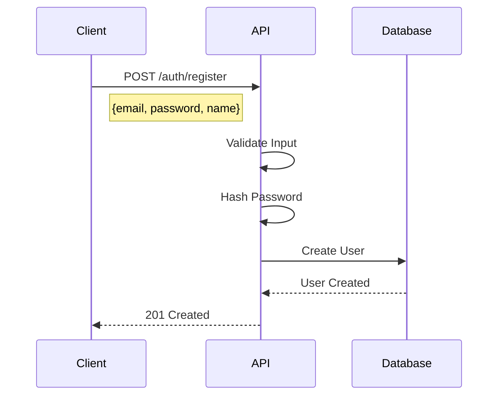
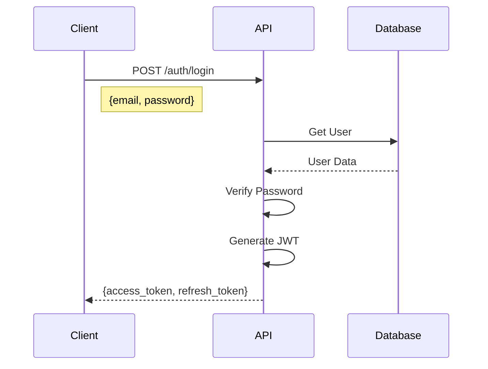
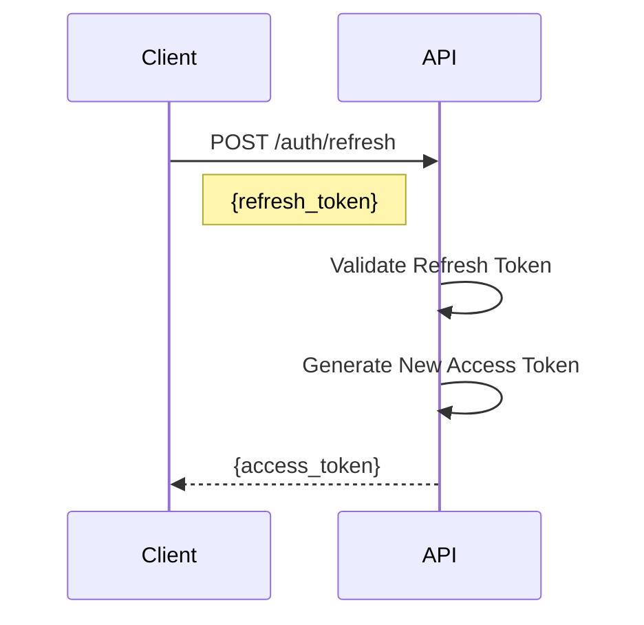
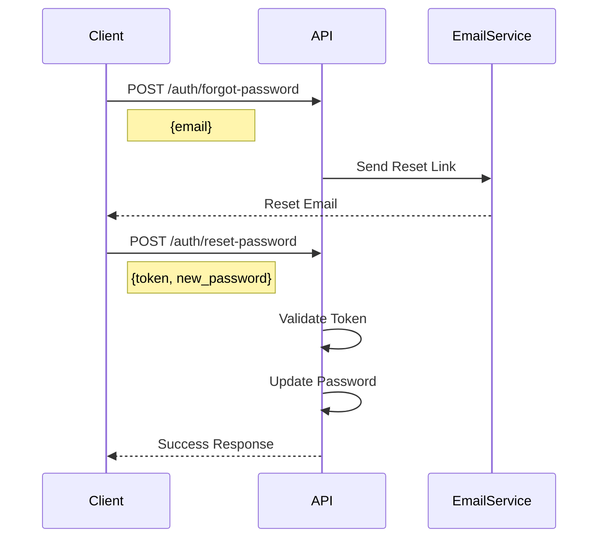

# Authentication Flows Documentation

## Overview
The Kundli Calculation Service uses JWT (JSON Web Token) based authentication with role-based access control (RBAC). This document details the authentication flows, token management, and security considerations.

## Authentication Flows

### 1. User Registration


#### Implementation Details:
- Password is hashed using bcrypt
- Email verification is required
- Duplicate email addresses are not allowed

### 2. User Login


#### Token Structure:
```json
{
    "access_token": {
        "header": {
            "alg": "HS256",
            "typ": "JWT"
        },
        "payload": {
            "sub": "user_id",
            "exp": 1704434994,
            "iat": 1704431394,
            "roles": ["user"],
            "permissions": ["read", "write"]
        }
    }
}
```

### 3. Token Refresh


### 4. Password Reset


## Role-Based Access Control (RBAC)

### User Roles
1. **Guest**
   - Can view public endpoints
   - Rate limited to 10 requests/minute

2. **User**
   - Can calculate basic kundli
   - Can view own kundlis
   - Rate limited to 100 requests/minute

3. **Premium**
   - Can calculate advanced kundli
   - Access to all features
   - Rate limited to 1000 requests/minute

4. **Admin**
   - Full system access
   - Can manage users
   - No rate limits

### Permission Matrix
| Endpoint                    | Guest | User | Premium | Admin |
|----------------------------|-------|------|---------|--------|
| /kundli/calculate (basic)  | ❌    | ✅   | ✅      | ✅     |
| /kundli/calculate (advanced)| ❌    | ❌   | ✅      | ✅     |
| /kundli/{id}              | ❌    | ✅*  | ✅*     | ✅     |
| /users                    | ❌    | ❌   | ❌      | ✅     |
| /admin                    | ❌    | ❌   | ❌      | ✅     |

*Only own kundlis

## Security Measures

### 1. Token Security
- Access tokens expire after 1 hour
- Refresh tokens expire after 7 days
- Tokens are invalidated on logout
- Blacklisting of compromised tokens

### 2. Rate Limiting
```python
RATE_LIMITS = {
    'guest': 10,    # requests per minute
    'user': 100,    # requests per minute
    'premium': 1000 # requests per minute
}
```

### 3. API Security Headers
```python
SECURITY_HEADERS = {
    'X-Frame-Options': 'DENY',
    'X-Content-Type-Options': 'nosniff',
    'X-XSS-Protection': '1; mode=block',
    'Strict-Transport-Security': 'max-age=31536000; includeSubDomains',
    'Content-Security-Policy': "default-src 'self'",
}
```

## Implementation Examples

### 1. Protected Route Decorator
```python
from functools import wraps
from fastapi import Depends, HTTPException
from app.core.security import get_current_user

def require_roles(*roles):
    def decorator(func):
        @wraps(func)
        async def wrapper(*args, **kwargs):
            user = await get_current_user()
            if not any(role in user.roles for role in roles):
                raise HTTPException(
                    status_code=403,
                    detail="Insufficient permissions"
                )
            return await func(*args, **kwargs)
        return wrapper
    return decorator

# Usage
@app.get("/premium-feature")
@require_roles("premium", "admin")
async def premium_feature():
    return {"message": "Premium content"}
```

### 2. Token Validation
```python
from jose import JWTError, jwt
from datetime import datetime, timedelta

def create_access_token(data: dict):
    to_encode = data.copy()
    expire = datetime.utcnow() + timedelta(hours=1)
    to_encode.update({"exp": expire})
    return jwt.encode(
        to_encode,
        settings.SECRET_KEY,
        algorithm=settings.ALGORITHM
    )

def verify_token(token: str):
    try:
        payload = jwt.decode(
            token,
            settings.SECRET_KEY,
            algorithms=[settings.ALGORITHM]
        )
        return payload
    except JWTError:
        raise HTTPException(
            status_code=401,
            detail="Invalid token"
        )
```

## Error Handling

### Common Authentication Errors
1. **Invalid Credentials**
```json
{
    "code": "AUTH001",
    "message": "Invalid email or password",
    "category": "authentication",
    "severity": "error"
}
```

2. **Token Expired**
```json
{
    "code": "AUTH002",
    "message": "Token has expired",
    "category": "authentication",
    "severity": "error"
}
```

3. **Insufficient Permissions**
```json
{
    "code": "AUTH003",
    "message": "Insufficient permissions for this resource",
    "category": "authorization",
    "severity": "error"
}
```

## Best Practices

1. **Token Management**
   - Store tokens securely (HttpOnly cookies)
   - Implement token refresh mechanism
   - Clear tokens on logout

2. **Password Security**
   - Enforce strong password policy
   - Implement rate limiting on login attempts
   - Use secure password reset mechanism

3. **API Security**
   - Use HTTPS only
   - Implement proper CORS policy
   - Add security headers
   - Rate limit authentication endpoints

4. **Error Handling**
   - Use standardized error responses
   - Don't expose sensitive information
   - Log authentication failures

## Monitoring and Alerts

### Key Metrics
1. Failed login attempts
2. Token refresh rate
3. Authentication latency
4. Rate limit hits
5. Permission denial counts

### Alert Conditions
1. Multiple failed logins from same IP
2. Unusual token refresh patterns
3. Spike in authentication errors
4. High rate of permission denials
